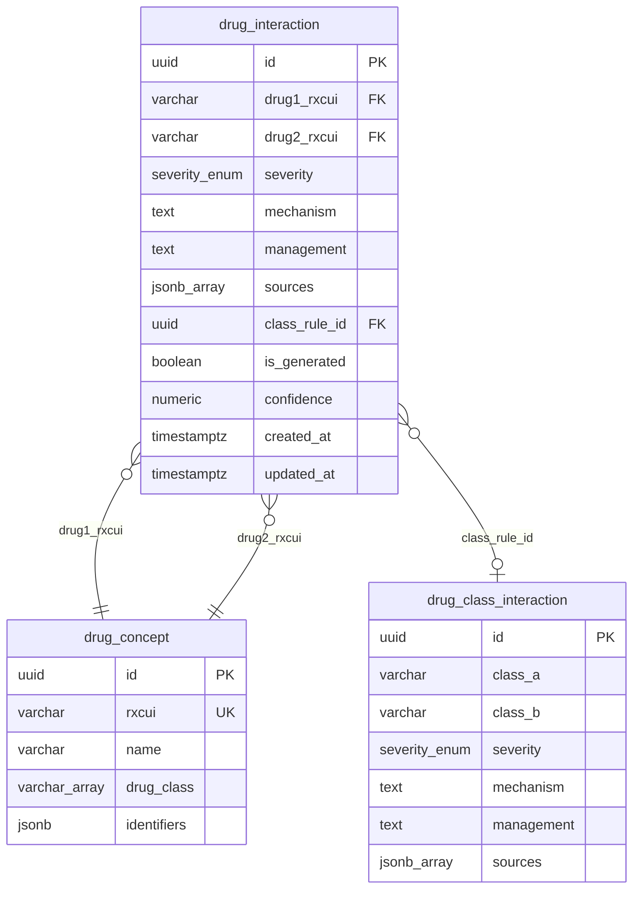

# Entity Relationships

> **Document type:** Data model reference
> **Scope:** Relationships between all core entities, class-expansion mechanics, and canonical query patterns

---

## ERD Diagram



---

## Relationship Descriptions

### `drug_interaction` to `drug_concept` (drug1)

Each `drug_interaction` row references one `drug_concept` row via `drug1_rxcui`. This is a
many-to-one relationship: one drug concept can appear as `drug1` in many interaction rows. The
foreign key is on `drug_concept.rxcui` rather than `drug_concept.id` because `rxcui` is the
canonical external identifier. All API inputs are resolved to RxCUI values before querying, and
all API outputs reference drugs by their RxCUI. Using `rxcui` as the FK target eliminates a join
to retrieve the identifier in the hot query path.

The `NOT NULL` constraint means every interaction row must reference a registered drug concept.
Ingestion adapters must insert or upsert the drug concept record before inserting the interaction
record.

### `drug_interaction` to `drug_concept` (drug2)

Identical structure to the `drug1` relationship. The two foreign key columns (`drug1_rxcui`,
`drug2_rxcui`) are stored as separate columns — not as an array — to allow the composite unique
index `(drug1_rxcui, drug2_rxcui)` and individual B-tree indexes on each column. An array of two
RxCUIs would prevent indexed lookups on the second element and make the uniqueness constraint
impossible to express without a custom operator.

The pair ordering convention (smaller RxCUI string stored as `drug1_rxcui`) ensures that a pair
`(warfarin, fluconazole)` and its reverse `(fluconazole, warfarin)` are represented by the same
row. The API query layer normalizes the incoming pair order before lookup; callers do not need
to know or respect the storage ordering.

### `drug_interaction` to `drug_class_interaction` (class rule origin)

The `class_rule_id` column is a nullable foreign key from `drug_interaction` to
`drug_class_interaction`. This relationship is optional: it is NULL for directly curated or NLP-
extracted pairs, and non-NULL for rows that were generated by the class-expansion engine.

The relationship encodes the provenance chain: a `drug_class_interaction` row describes a rule
at the pharmacological class level; each `drug_interaction` row with a matching `class_rule_id`
is a concrete materialization of that rule for a specific drug pair. If a class rule is updated
(severity changes, mechanism is revised), all child `drug_interaction` rows with that
`class_rule_id` can be identified and regenerated or updated in a single targeted operation.

The cardinality is many-to-one from `drug_interaction` to `drug_class_interaction`: one class
rule can generate many concrete pair rows, but each generated pair traces back to exactly one
class rule.

### The class-expansion relationship in detail

The `drug_class_interaction` table and the `drug_concept.drug_class` column together define the
class-expansion mechanism. No direct foreign key exists between `drug_class_interaction` and
`drug_concept` — the relationship is implicit through the class name strings.

At query time, the expansion join works as follows:

1. A request arrives for drug pair (A, B) where both A and B are resolved RxCUI values.
2. The query engine looks up `drug_concept.drug_class` for both A and B.
3. It queries `drug_class_interaction` for rows where `class_a` is any class of A and `class_b`
   is any class of B (or vice versa, since pair order is not enforced in this table).
4. Matching class rules are returned alongside any direct `drug_interaction` rows for the pair.
5. If a direct pair row exists with the same or a more specific severity, it takes precedence
   over the class rule in the response.

Class names must be consistent between `drug_concept.drug_class` values and `drug_class_interaction.class_a`/`class_b` values. A mismatch (e.g., `'NSAIDS'` in one table vs. `'NSAID'`
in another) silently breaks the expansion for all drugs in that class. A canonical class name
registry is maintained in the `packages/core` shared types to prevent this.

---

## Query Patterns

### Pattern 1: Single Pair Lookup

The most common query: check whether a known interaction exists between two specific drugs.

```sql
SELECT
  di.id,
  di.severity,
  di.mechanism,
  di.management,
  di.sources,
  di.is_generated,
  di.confidence,
  di.class_rule_id
FROM drug_interaction di
WHERE
  (di.drug1_rxcui = $1 AND di.drug2_rxcui = $2)
  OR
  (di.drug1_rxcui = $2 AND di.drug2_rxcui = $1);
```

The application layer normalizes the pair order before executing this query, so typically only
one of the two OR branches matches. The composite unique index on `(drug1_rxcui, drug2_rxcui)`
makes this a two-row index scan at most. The OR is included as a safety net for callers that
do not normalize ordering.

### Pattern 2: All Interactions for a Drug

Returns all known interactions for a single drug — used by `GET /v1/drugs/:rxcui/interactions`.

```sql
SELECT
  di.id,
  di.drug1_rxcui,
  di.drug2_rxcui,
  di.severity,
  di.mechanism,
  di.management,
  di.sources,
  di.is_generated,
  di.confidence,
  dc1.name  AS drug1_name,
  dc2.name  AS drug2_name
FROM drug_interaction di
JOIN drug_concept dc1 ON dc1.rxcui = di.drug1_rxcui
JOIN drug_concept dc2 ON dc2.rxcui = di.drug2_rxcui
WHERE
  di.drug1_rxcui = $1
  OR di.drug2_rxcui = $1
ORDER BY di.severity;
```

This query uses the composite index to locate rows where `drug1_rxcui = $1` (leading column
match, efficient) and a secondary scan for rows where `drug2_rxcui = $1`. For datasets at the
expected scale (5,000–50,000 rows), this is fast without a separate index on `drug2_rxcui`
alone. If query plans degrade at larger scale, an additional index on `drug2_rxcui` individually
can be added without a schema change.

### Pattern 3: Class Expansion Join

Finds all class-level rules that apply to a given drug pair based on their drug class
memberships. Used when no direct `drug_interaction` row is found, or when the API is asked to
include class-derived interactions alongside direct ones.

```sql
SELECT
  dci.id         AS class_rule_id,
  dci.class_a,
  dci.class_b,
  dci.severity,
  dci.mechanism,
  dci.management,
  dci.sources
FROM drug_class_interaction dci
WHERE
  (
    dci.class_a = ANY(
      SELECT unnest(drug_class) FROM drug_concept WHERE rxcui = $1
    )
    AND
    dci.class_b = ANY(
      SELECT unnest(drug_class) FROM drug_concept WHERE rxcui = $2
    )
  )
  OR
  (
    dci.class_a = ANY(
      SELECT unnest(drug_class) FROM drug_concept WHERE rxcui = $2
    )
    AND
    dci.class_b = ANY(
      SELECT unnest(drug_class) FROM drug_concept WHERE rxcui = $1
    )
  );
```

The GIN index on `drug_concept.drug_class` accelerates the `ANY(unnest(...))` subqueries. For
production use, the Resolver Service caches the `drug_class[]` arrays for recently queried drugs
so the subqueries are typically resolved from application-layer cache rather than a database
round-trip. The class name strings returned are then matched against `drug_class_interaction`
using the unique index on `(class_a, class_b)`.
